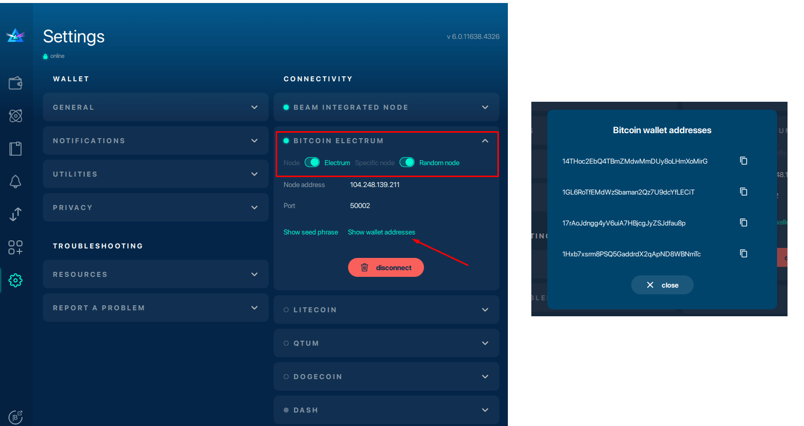
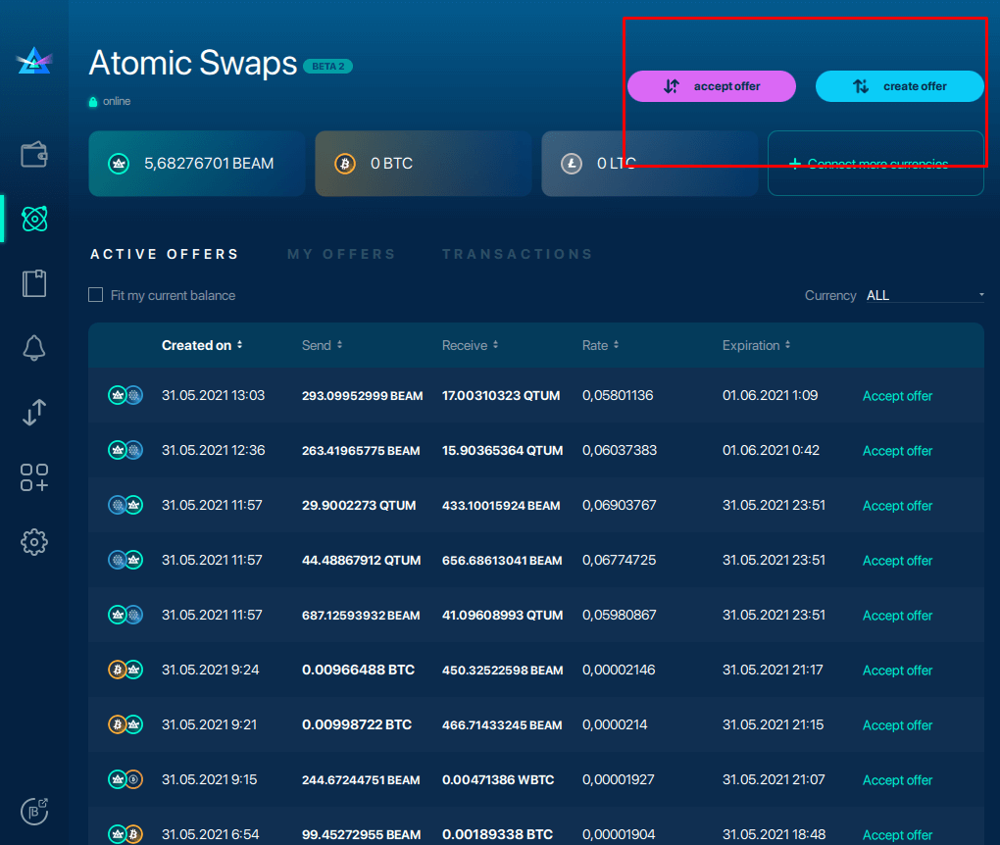

# Electrum Atomic Swaps Configuration

## Connect with Electrum Wallet

If you have an Electrum wallet, connecting to a remote node follows a similar yet more straightforward process:

### Edit Electrum Wallet Settings

1. **Settings****> toggle "Node" to "Electrum."**
2. Enter your Electrum address.
3. Enter an existing seed phrase or generate a new one (you can change wallets at any time).

Once connected, you should be able to see the list of all wallet addresses in your Electrum wallet by clicking "Show wallet addresses."

Once you have optimized and synchronized your nodes in the settings tabs, you will now be able to accept Atomic Swap offers.

