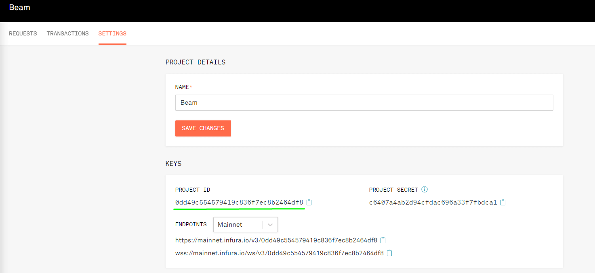
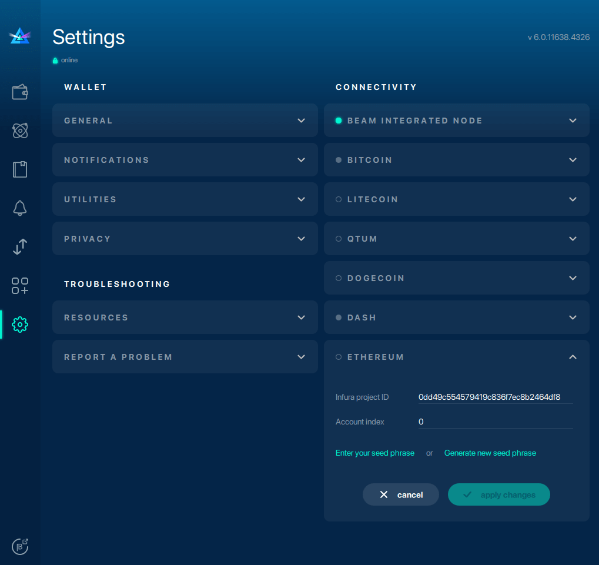
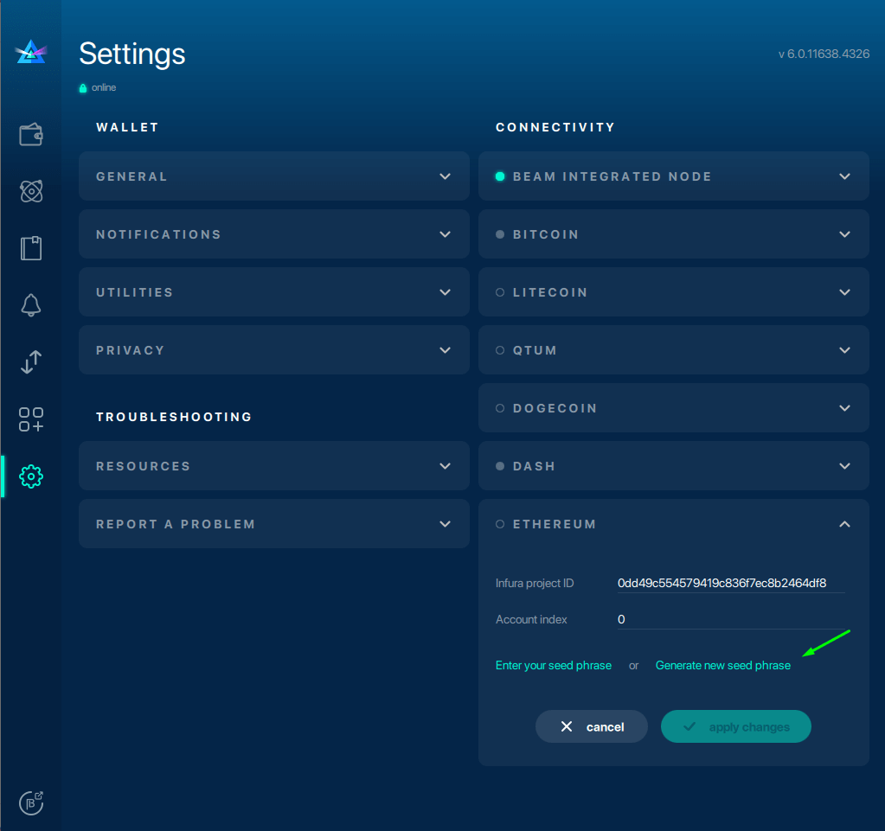
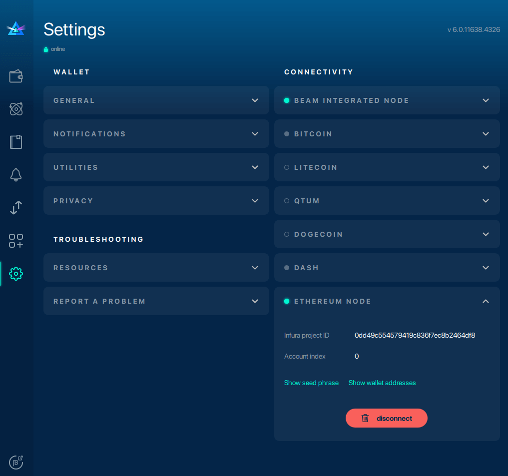
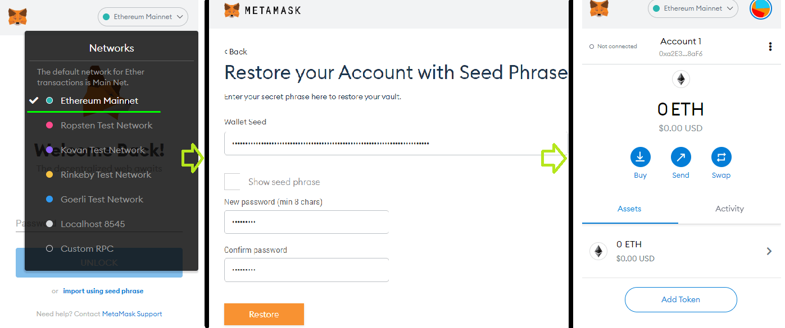
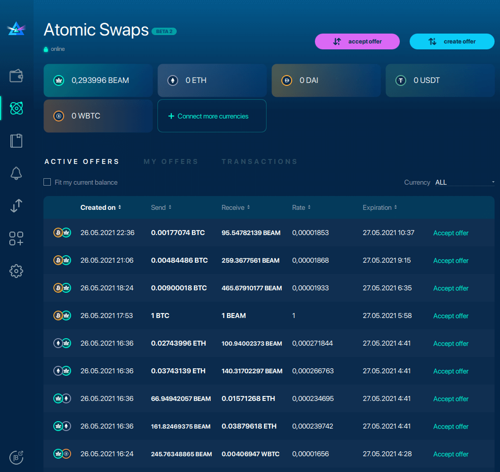

# Ethereum Atomic Swaps Configuration

## Connecting to Ethereum

To link your Ethereum and Beam wallets together, you must have an Infura account as well as an Ethereum Metamask.

[Infura](https://infura.io/) is the API service that broadcasts information from the Ethereum blockchain, and [Metamask](https://metamask.io/) is a browser-based Ethereum wallet.

Note: [infura.io](https://www.infura.io) requires specific parameters from your Beam wallet as well as valid email address verification.

Before attempting to create an Ethereum <> Beam Atomic Swap make sure your wallet balance has enough Ethereum to cover mining fees.

## To connect to Ethereum

1. **Launch** [infura.io.](http://www.infura.io)
2. Go to **Settings > "keys" > Copy Project ID.**
3. **Launch** your Beam wallet.
4. Go to **Settings****> "Connectivity" > "Ethereum" > Paste Project ID.**
5. **Click "Generate Seed Phrase"** to generate the seed phrase you will import to your Metamask. You can also use an existing seed phrase.
6. **Copy seed phrase > "apply changes" > "Connect to node."**
7. **Launch** **Metamask > click "import using account seed phrase."**
8. Enter your seed phrase and create a strong wallet password.

If you have successfully linked your accounts, a green light will appear next to the Ethereum node indicating the connection was a success!

## How it looks in your wallet

### Infura.io

Copy this project ID string.

### Beam wallet settings

Paste your Infura Project ID under "Ethereum."

### Generate a new seed phrase

Click "apply changes" after you have copied your seed phrase.

### Connect to Ethereum

### Import Ethereum seed phrase

The next step is to import the Ethereum seed phrase into a Metamask wallet. At the bottom of your Metamask browser extension, click "Import using account seed phrase." Enter your seed phrase and create a password.

### Atomic Swaps screen

