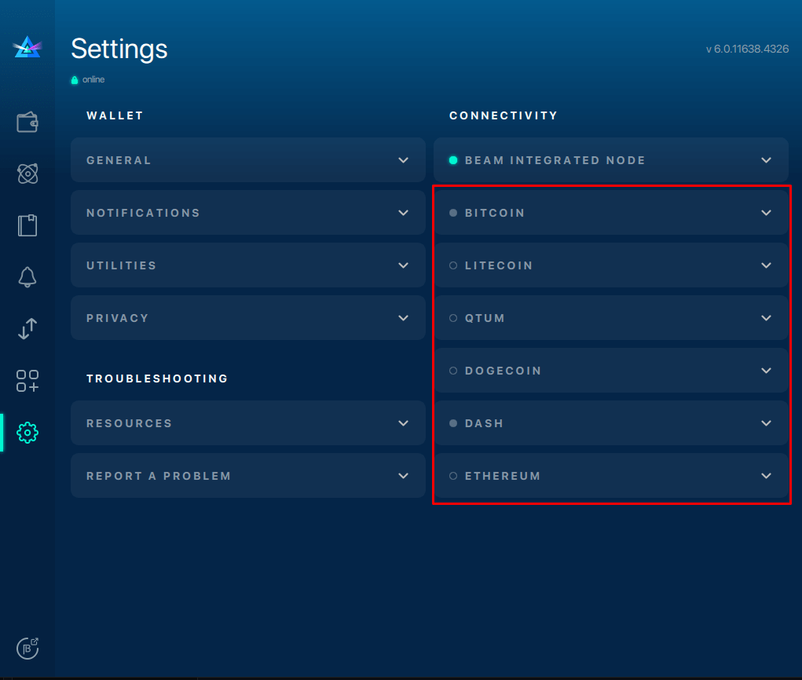

# RPC Full Node Atomic Swaps Configuration

## Connecting to Full Node via Litecoin

To connect Litecoin with your Beam wallet via full node, follow the steps below:

### Edit Litecoin Configuration File

Using a text editor, open the `Litecoin.conf` file and enter the following parameters to configure Litecoin to run with JSON RPC:

```
# server=1 tells Litecoin-QT to accept JSON-RPC commands.
server=1

rpcport=9432

# You must set rpcuser and rpcpassword to secure the JSON-RPC api
rpcuser=liteuser
rpcpassword=123
```

Save your changes to `Litecoin.conf`.

### Synch Litecoin Node with Beam Wallet

Go to **Settings**.



### Enter Litecoin Node Address

Under the Litecoin tab, **enter the node ip:port address along with the RPC username and password**. The fee paid on the respective chain per Kb of transaction size can be left at the default value.

**Click Apply > Connect.**

A green light will appear next to **Litecoin Node,** indicating the connection was a success!


