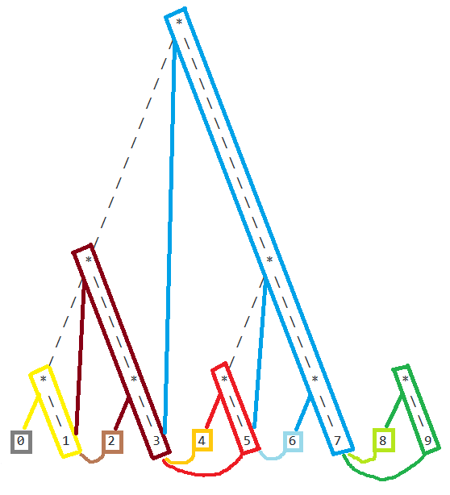

# Core Merkle Structures

Reference documentation for the Merkle tree and authenticated data structures used throughout Beam. All constructs are defined in `core/merkle.h`, `core/radixtree.h`, and their implementations.

Two tree families serve distinct roles:

- **MMR (Merkle Mountain Range)** — an append-only structure used for sequential sets such as the history of all inherited system states.
- **Radix Hash Tree** — a binary search tree with per-node Merkle hashes, used for the live UTXO set and kernel set.

---

## Proof Types

Beam uses two proof encodings.

**Standard proof** (`Merkle::Proof` = `std::vector<Node>`)  
Each node is a `(bool, Hash)` pair — the hash of the sibling and a direction flag (`false` = sibling is on the left).

**Hard proof** (`Merkle::HardProof` = `std::vector<Hash>`)  
Only the sibling hashes are included; the direction at each level is deduced by the verifier from the known tree structure and element position. This is smaller and more robust — it prevents an attacker from presenting the same element at a different position by reordering the proof.

Hard proofs are used wherever the verifier knows the full tree layout in advance, most notably for inherited system state proofs.

The `IProofBuilder` interface is implemented by both `ProofBuilderStd` (accumulates a `Proof`) and `ProofBuilderHard` (accumulates a `HardProof`) and is passed to MMR proof-generation routines.

```cpp
struct IProofBuilder {
    virtual bool AppendNode(const Node&, const Position&) = 0;
};
```

`HardVerifier` drives verification of a `HardProof` against a running hash value; `InterpretMmr` handles the full MMR traversal.

---

## MMR (Merkle Mountain Range)

### Structure

An MMR is a potentially incomplete Merkle tree filled left-to-right. As leaves are appended they form a sequence of complete binary sub-trees of strictly decreasing height (the "mountain range"). Sub-tree roots are combined into a single root by pairing from right to left, where the right-child root is "promoted" to the height of the left sub-tree without any special handling.

Non-leaf hashes are computed as:

```
Hash(left_child || right_child)   // using Blake2b / SHA-256 depending on context
```

Proof length varies by element position because the sub-tree structure is not uniform.

`Position` identifies any node in the tree:

```cpp
struct Position {
    uint8_t  H;   // height (0 = leaf)
    uint64_t X;   // horizontal index at that height
};
```

### `Mmr` Abstract Base

`Mmr` provides the core append, replace, root-hash, and proof-building operations. Subclasses supply storage by implementing two virtual methods:

```cpp
virtual void LoadElement(Hash&, const Position&) const = 0;
virtual void SaveElement(const Hash&, const Position&) = 0;
```

Key operations:
- `Append(hash)` — adds a new leaf and recomputes ancestor hashes up the mountain.
- `get_Hash(out)` — returns the current root hash.
- `get_PredictedHash(out, hvAppend)` — cheaply computes what the root would be after appending one more element, without actually appending it. Used when assembling a block header.
- `get_Proof(builder, i)` — generates a Merkle proof for element `i`.

### MMR Implementations

| Class | Storage | Use case |
|---|---|---|
| `FixedMmr` | `std::vector<Hash>` (flat/diagonal layout) | Small known-size MMRs where random access is needed |
| `CompactMmr` | Only the rightmost branch (`m_vNodes`) | Cheap root-hash updates; cannot generate proofs |
| `FlyMmr` | No storage; recomputes on demand | Rare queries where allocating extra hashes is undesirable |
| `DistributedMmr` | Per-element; no global array | Branching histories — each block carries its own MMR delta |

`FlatMmr` is a layout helper that maps a `Position` to an index in a flat array using a "diagonal" scheme (`Pos2Idx`), avoiding gaps.

### DistributedMmr (DMMR)

`DistributedMmr` is the most important variant for Beam's chain data. The key design decision: **every appended element owns all the new non-leaf node data it creates**, with no modification of previously stored elements. This allows arbitrary-height trees to coexist across different chain branches without copying.

Each element in a DMMR stores:
1. The hashes of all new ancestor nodes formed when this element was appended.
2. Pointers (`Key` = `uint64_t`) to the sibling elements that own the other half of each new ancestor.
3. A pointer to the last element of the previous MMR peak.

Elements with an odd index carry the most extra data; elements at positions `2^n - 1` carry no peak-pointer because they are the sole peak.

**DMMR layout for 10 elements:**

```
                         *
                        / \
                       /   \
                      /     \
                     /       \
                    /         \
                   /           \
                  /             \
                 /               \
                /                 \
               /                   \
              /                     \
             *                       *
            / \                     / \
           /   \                   /   \
          /     \                 /     \
         /       \               /       \
        /         \             /         \
       *           *           *           *           *
      / \         / \         / \         / \         / \
     /   \       /   \       /   \       /   \       /   \
    0     1     2     3     4     5     6     7     8     9
```



In this layout, each element stores the hashes it *created* when appended (marked with `*`) and pointers to the sibling elements that own the other half of each ancestor. Elements 0 and 1 store no extra hashes. Element 1 stores 1 extra hash and 1 sibling pointer. Element 3 stores 2 extra hashes and 2 sibling pointers. Elements at `2^n - 1` positions (1, 3, 7) are sole peaks and need no peak-pointer. All other elements include a pointer to the last element of the previous peak.

**Use in Beam:** Every `SystemState::Full` implicitly extends the DMMR of all inherited states. The DMMR root contributes directly to the `m_Definition` field checked during block validation. See [Core Block and Chain State](Core-Block-And-Chain-State.md).

### MultiProof

When a prover must prove multiple elements and the verifier knows the tree structure, `MultiProof` merges all individual proofs into a single compact encoding by omitting hash nodes that appear in more than one proof path.

Elements must be added in sorted order. The `MultiProof::Builder` accumulates the merged proof; `MultiProof::Verifier` drives verification against a known root, deducing Merkle paths internally.

```cpp
struct MultiProof {
    std::vector<Hash> m_vData;  // merged hash sequence

    class Builder : private IProofBuilder { ... };
    class Verifier : private PathCaclulator { ... };
};
```

`MultiProof` is used by `Block::ChainWorkProof` to encode the sampled state proofs in the FlyClient protocol.

---

## Radix Hash Tree

### `RadixTree` Base

`RadixTree` is a 1-bit radix (binary) prefix tree with two properties that differ from classic Patricia trees:

- **Lazy split:** Internal (joint) nodes are created only where the key space actually diverges; a singleton tree has exactly one leaf and no joint nodes.
- **Lazy hash evaluation:** Internal node hashes are computed only when requested, and only if marked dirty. All keys must have the same bit-length within a given tree instance.

Node variants:

```cpp
struct Node {
    uint16_t m_Bits;           // bits remaining to next split; flags in high bits
    static const uint16_t s_Clean = 1 << 0xf;   // hash is up to date
    static const uint16_t s_Leaf  = 1 << 0xe;   // this is a leaf
};

struct Joint : public Node {
    Ptr<Node> m_ppC[2];        // left and right children
    Ptr<uint8_t> m_pKeyPtr;    // pointer to key (owned by a descendant leaf)
};

struct Leaf : public Node { };
```

Traversal is tracked with a `CursorBase` that records the parent pointer chain from root to current node. This avoids parent pointers in the nodes themselves, saving memory.

### `RadixHashTree`

Extends `RadixTree` by adding a `Merkle::Hash` to each `Joint` node. The hash of each internal node is:

```
Joint.Hash = Hash(left_child.Hash || right_child.Hash)
```

`get_Hash()` triggers a bottom-up recomputation of any dirty nodes and returns the root hash.

`get_Proof(proof, cursor)` generates a standard Merkle proof for the leaf at `cursor`.

### `RadixHashOnlyTree`

A concrete specialization of `RadixHashTree` where leaves store a 256-bit hash as both key and value. Used for the kernel set — each kernel is keyed by its ID (a `Merkle::Hash`).

### `UtxoTree`

The main UTXO set data structure. Extends `RadixHashTree` with:

1. **Composite key** — 321 bits: 257-bit `ECC::Point` (commitment) followed by 64-bit `Height` (maturity).
2. **Duplicate support** — multiple UTXOs with identical commitment and maturity are counted within a single leaf via `m_Count`.
3. **TxoID chain** — when `m_Count > 1`, a linked list of `TxoID` values (`IDQueue`) is stored to track individual outputs.

```cpp
struct UtxoTree::Key {
    static const uint16_t s_BitsCommitment = ECC::uintBig::nBits + 1; // 257
    static const uint16_t s_Bits = s_BitsCommitment + 64;             // 321
    uintBig_t<(s_Bits + 7) / 8> V;
};

struct UtxoTree::MyLeaf : public Leaf {
    Key           m_Key;    // commitment || maturity
    // m_Count via IsExt() / IDQueue
};
```

**Leaf hash formula:**

```
UtxoLeaf.Hash = Hash(Key_bits_zero_padded || m_Count)
```

**Group search:** Because the commitment prefix is the most significant part of the key, a range query on commitment (with varying maturity) is a prefix search — the node finds the UTXO with the specified commitment and the lowest qualifying maturity without scanning the whole set.

### Merkle Disproof (Non-Existence Proof)

The radix structure enables proof that an element does *not* exist. The prover presents the two leaves adjacent to the queried key (or one if the key is beyond the min/max) along with their Merkle proofs. The verifier checks that:

1. Both siblings are valid members of the tree (proofs verify against the known root).
2. The queried key falls strictly between the two sibling keys.

This requires the verifier to trust that the tree was built correctly (i.e., elements are unique and ordered). When verifying multiple proofs together, the verifier also checks that the sibling sets are mutually consistent.
